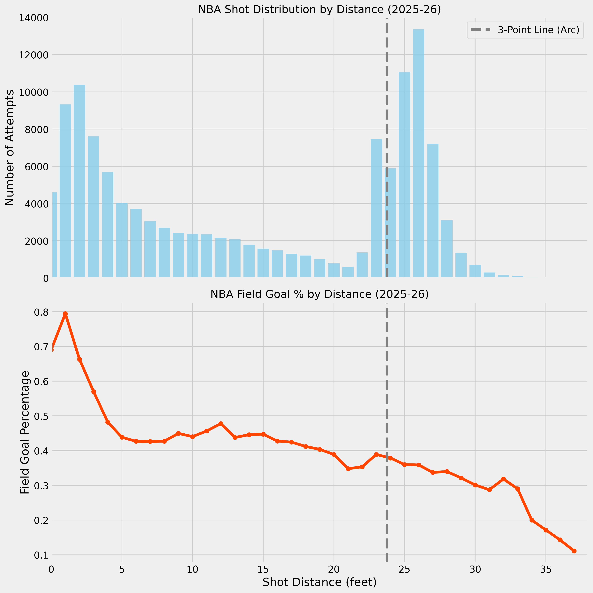

# Abstract

This paper presents a reproducible, data-driven examination of the analytical evolution of NBA offensive strategy. We detail the creation and use of a comprehensive, longitudinal shot dataset compiled via a custom data pipeline. This pipeline systematically ingests data from official NBA and ESPN APIs, processing and structuring it into a consolidated SQLite database that encompasses over a decade of league history—from the 2014-15 season through the 2025-26 season, including both regular season and playoff games. Using this rich historical data, with a primary focus on the 2025-26 season for a current snapshot, we derive summary efficiency metrics and employ Python-based visualizations, including hexbin density heatmaps and shot distance charts. The results reveal a strong and persistent concentration of shot attempts at the rim and from three-point range, coupled with a pronounced and corresponding decline in mid-range shot volume. These findings provide a clear, empirical validation of the thesis that modern NBA offenses are strategically optimized to prioritize shots with the highest expected value. This work serves as both a detailed case study of the contemporary game and establishes a robust empirical baseline for future player- and team-level trend analysis, clustering, and predictive modeling.

# Introduction

The National Basketball Association (NBA) has undergone a profound data revolution over the past two decades, fundamentally altering strategies and analysis. This paper addresses the core challenge of translating this wealth of data into actionable insights by leveraging a comprehensive, custom-built NBA shot dataset. Spanning an extensive period from the 2014-15 season through the 2025-26 season, and encompassing both regular season and playoff contests, this dataset was meticulously compiled via a bespoke R package sourcing data from official NBA and ESPN APIs into a robust SQLite database. Utilizing this rich repository, we present an initial exploratory analysis focused on visualizing and quantifying league-wide shot selection trends. Our findings, primarily illustrated through shot density heatmaps and shot distance analyses for the 2025-26 season, reveal a clear and consistent strategic shift towards high-efficiency attempts at the rim and from beyond the three-point arc, underscoring the pervasive influence of analytical principles on modern basketball offense.

To answer these questions effectively, a robust and flexible dataset is not just an asset; it is a necessity. This project began by addressing the limitations of publicly available, pre-packaged data through a significant data engineering effort. A custom R package was developed to programmatically interface with and ingest data from multiple sources, including the official NBA API and the ESPN API. This pipeline automates the process of fetching raw JSON data from various endpoints, parsing the complex nested structures, and writing the cleaned, organized information into both RDS files for granular analysis and a consolidated SQLite database for efficient querying. The resulting database is a rich repository containing nearly every facet of game and player statistics, providing a powerful foundation for in-depth exploratory data analysis (EDA).

With this data infrastructure in place, the initial phase of analysis has focused on visualizing league-wide shooting trends. A shot density heatmap has been generated to illustrate the spatial distribution of shot attempts across the court, and an accompanying analysis of shot distance provides further insight into shot selection patterns. This paper presents these initial findings and lays the groundwork for future research, which will include more advanced EDA, player and team clustering based on playstyle, and the potential development of an interactive dashboard or AI-powered query tool to make this rich dataset even more accessible.

**Contributions**

- A reproducible data pipeline that consolidates NBA play-by-play and shot-chart data into an analysis-ready SQLite database.
- League-wide shot selection summaries for the 2025-26 regular season, including efficiency metrics and attempt distribution.
- High-resolution shot density visualizations with standardized court geometry for consistent spatial analysis.

**Paper Roadmap**

Section 2 reviews relevant background on shot selection trends. Section 3 details data sources, processing steps, and visualization methods. Section 4 reports descriptive results and references all figures/tables. Section 5 interprets findings, discusses limitations, and outlines next steps.

# Related Work / Background

Prior research on basketball analytics has emphasized the relationship between shot location and scoring efficiency, often highlighting a shift toward three-point volume and rim attempts as a rational response to expected value. This study builds on that line of work by providing a fully reproducible, league-wide view of shot distribution in the 2025-26 season.

*Citation placeholder:* Please add 1–3 primary sources on shot selection efficiency and the growth of three-point attempts in the NBA to support this background section.

# Methods

```{r setup, include=FALSE}
knitr::opts_chunk$set(echo = TRUE, message = FALSE, warning = FALSE)
set.seed(123)
suppressPackageStartupMessages({
  library(dplyr)
  library(arrow)
  library(knitr)
  library(DBI)
  library(RSQLite)
})
```

## Data Sources and Pipeline

The foundation of this analysis is a robust and flexible dataset of NBA shot data. This dataset was meticulously compiled through a custom-built data pipeline designed to overcome the limitations of readily available pre-packaged statistics. An R package was developed to programmatically interact with and extract comprehensive play-by-play and shot-chart data from two primary sources: the official NBA API and the ESPN API. This custom solution provided granular control over data acquisition, ensuring that a broad spectrum of information — from shot coordinates and outcomes to player and game metadata — could be systematically collected.

The raw data, initially retrieved in JSON format from the API endpoints, underwent a rigorous processing phase. Within the R environment, these JSON responses were parsed, cleaned, and structured into an organized format. This structured data was then persisted as `.rds` files, providing efficient R-native storage for detailed, session-specific analysis. For broader and more accessible querying capabilities, the data was subsequently loaded into a normalized SQLite database (`nba.sqlite`). This relational database serves as the central repository for the project, enabling efficient querying and integration of diverse NBA statistics, excluding only real-time odds data.

## Analysis Dataset

For the descriptive results in this paper, we use the season-level shot file exported from the database: `analysis/shots_with_xp_2025-26.parquet`. This file contains shot coordinates, outcomes, and derived expected points (xP) fields. Expected points are not currently stored in SQLite, so the parquet file is used for xP-based summaries.

```{r load-shots}
shots <- arrow::read_parquet("shots_with_xp_2025-26.parquet")
```

## SQL Extraction (Reproducible Query)

The SQLite database remains the canonical source for raw shot data. The following query demonstrates how to pull the season-level shot data directly from SQLite for reproducibility in the paper. Update `db_path` and the table name as needed to match your local database schema.

```{r sql-query-example}
db_path <- "analysis/nba.sqlite"

if (!file.exists(db_path)) {
  message("SQLite database not found at: ", db_path)
} else {
  con <- DBI::dbConnect(RSQLite::SQLite(), db_path)

  shots_sql <- DBI::dbGetQuery(con, "
    SELECT
      LOC_X,
      LOC_Y,
      SHOT_MADE_FLAG,
      SHOT_TYPE,
      SHOT_DISTANCE_FEET
    FROM shots
    WHERE SEASON = '2025-26'
      AND SEASON_TYPE = 'Regular Season'
  ")

  DBI::dbDisconnect(con)
}
```

## Visualization

For the purpose of generating the shot density heatmaps presented in this paper, data for the 2025-26 NBA regular season was extracted from the SQLite database using a Python script, `shot_density.py`. This script leverages the `pandas` library for efficient data manipulation and filtering. Specifically, shot attempt data, including `LOC_X` and `LOC_Y` coordinates, `SHOT_MADE_FLAG`, `SHOT_TYPE`, and `SHOT_ZONE_BASIC`, was loaded for the specified season and season type. A custom `summarize_shots` function within the script aggregates these raw shot attempts to calculate overall field goal percentages, two-point and three-point percentages, and detailed shooting efficiencies for various court zones.

The visualization of shot density was achieved using `matplotlib`, a comprehensive plotting library in Python. A hexbin plot was employed to effectively represent the spatial concentration of shot attempts. This technique divides the court into a grid of hexagonal bins, with the color intensity of each hexagon corresponding to the logarithm of the number of shot attempts originating from that area. The logarithmic scale was chosen to better highlight variations in density across both high-volume (e.g., restricted area) and lower-volume (e.g., mid-range) regions of the court. To provide essential context, the hexbin plot is overlaid onto a precisely drawn NBA court diagram, rendered by a `draw_court` function. This function recreates the standard NBA court dimensions and markings, including the three-point line, free-throw line, and restricted area. The final visualizations incorporate statistical summaries dynamically generated from the shot data, displayed alongside the court to provide immediate quantitative context to the visual patterns observed. To ensure versatility for various publication mediums, the script was configured to generate two versions of the heatmap: one with a dark theme suitable for digital displays and another with a light theme optimized for print.

# Results

## Summary Metrics

```{r summary-metrics}
summary_metrics <- shots |>
  mutate(
    shot_value = if_else(SHOT_TYPE == "3PT Field Goal", 3L, 2L),
    made = SHOT_MADE_FLAG == 1L
  ) |>
  summarise(
    attempts = n(),
    fg_pct = mean(made),
    fg2_pct = mean(made[SHOT_TYPE == "2PT Field Goal"]),
    fg3_pct = mean(made[SHOT_TYPE == "3PT Field Goal"]),
    avg_distance = mean(SHOT_DISTANCE_FEET, na.rm = TRUE)
  )

kable(
  summary_metrics,
  digits = 3,
  caption = "League-wide shooting summary for the 2025-26 regular season."
)
```

```{r shot-distance-fig, echo=FALSE, fig.cap="Shot distance distribution for the 2025-26 regular season.", fig.align="center", out.width="0.95\\linewidth", fig.pos="H"}

```

```{r shot-density-fig, echo=FALSE, fig.cap="League-wide shot density heatmap for the 2025-26 regular season.", fig.align="center", out.width="0.95\\linewidth", fig.pos="H"}

```

\newpage

## Shot Selection Patterns

The shot density heatmap provides a visual representation of contemporary league-wide shot selection and offers immediate insight into strategic offensive preferences. Two regions of exceptionally high shot density are apparent: the area directly under the basket (restricted area) and the three-point arc, particularly along the wings and the top of the key. These two zones form the dominant hot spots on the court.

In contrast, the heatmap reveals pronounced "cold spots" in the mid-range area. The regions approximately 10-20 feet from the basket show a significantly lower density of shot attempts across both the elbows and baselines. This pattern indicates a league-wide strategic de-emphasis on mid-range shots in favor of higher-value attempts.

The summary metrics table provides quantitative support for these observed spatial patterns. Overall field goal percentage, two-point percentage, and three-point percentage are reported alongside the average shot distance for the 2025-26 regular season.

# Discussion

The concentration of shot attempts at the rim and from beyond the three-point arc, coupled with the reduction in mid-range volume, reflects an efficiency-driven offensive philosophy. While the three-point conversion rate is typically lower than two-point accuracy, the added point value increases expected points per attempt, making three-point attempts strategically advantageous at scale.

The strategic implications are clear: teams are actively manufacturing opportunities from these high-value zones, accepting a slightly lower individual percentage on three-pointers for the elevated overall scoring potential. Conversely, the scarcity of mid-range attempts highlights a conscious tactical decision to avoid shots that offer a less favorable expected value.

These findings have significant implications for various facets of basketball:

- **Offensive Strategy:** Teams will continue to emphasize spacing, ball movement, and screening actions to create open looks from the rim and three-point line. Offensive systems are built to eliminate mid-range pull-ups as primary options.
- **Player Development:** Players are increasingly being developed with an emphasis on three-point shooting range and efficiency, alongside the ability to finish strong at the rim. The traditional mid-range specialist role has diminished.
- **Defensive Schemes:** Defenses are consequently forced to prioritize protecting the rim and contesting three-point attempts, often leading to strategies that funnel offensive players into less efficient mid-range areas, implicitly conceding these shots.

## Limitations and Ethics

This study reports league-wide averages and does not account for game context (score differential, shot clock, defensive pressure), which can materially affect shot quality. The analysis is based on publicly available data and does not include sensitive or personally identifiable information; nevertheless, care should be taken when extending the work to player-level evaluations to avoid overgeneralization from aggregate trends.

# Conclusion

This paper presented an in-depth analysis of NBA shot selection for the 2025-26 regular season, underpinned by a custom-built data acquisition and processing pipeline. Leveraging a shot density heatmap visualization, we have demonstrated the league-wide strategic emphasis on maximizing offensive efficiency. The visual evidence, supported by quantitative metrics, confirms a concentrated focus on shot attempts at the rim and from beyond the three-point arc, while simultaneously revealing a marked deprioritization of mid-range jump shots.

Despite these clear findings, it is important to acknowledge certain limitations of this analysis. The presented heatmap provides a league-average perspective, thus smoothing over potentially significant variations at the individual player or team level. Different teams may employ unique offensive systems, and elite players often possess specialized skill sets that allow them to defy league-average efficiency trends from certain areas of the court. Furthermore, this analysis focuses solely on shot location and frequency, without incorporating other crucial contextual factors such as shot clock situation, defensive pressure, or game state, which all influence shot quality.

Looking ahead, this research establishes a robust foundation for numerous avenues of future investigation. Comparative studies across multiple seasons could track the dynamic evolution of shot selection trends. A compelling extension would involve focusing on individual player shot charts, such as `Stephen_Curry_poe_shotchart.png`, to identify unique scoring profiles and assess player-specific efficiency from various zones. Moreover, clustering analysis could be employed to group players or teams based on their shot selection tendencies. Integrating advanced metrics on shot quality (e.g., open vs. contested shots) and developing interactive dashboards to explore these datasets represent further promising directions.

# References
