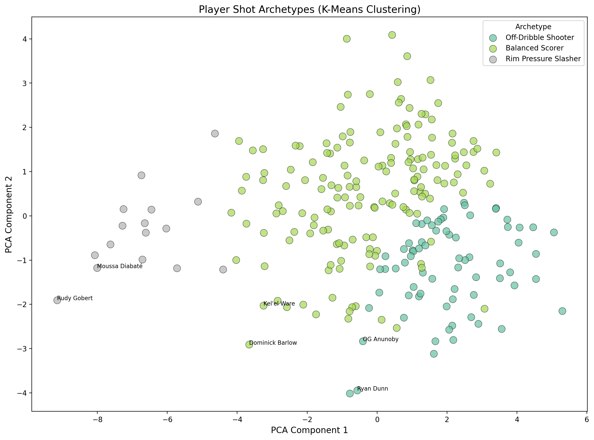
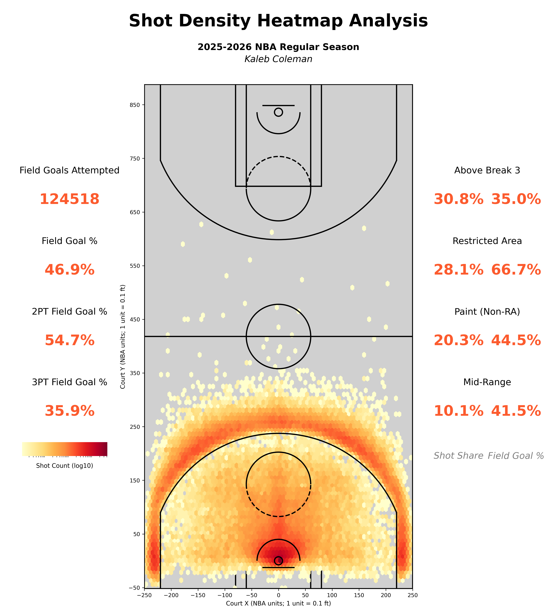

# Abstract

This paper presents a reproducible, data-driven examination of NBA offensive strategy and player performance. We detail a comprehensive shot dataset compiled via a custom data pipeline spanning the 2014-15 through 2025-26 seasons. Using this data, we develop an expected field goal (xFG) model via logistic regression, achieving 63% accuracy with 0.653 AUC-ROC. Building on this foundation, we introduce three advanced analytics products: (1) Residual Analysis to identify players who over/underperform expectations, (2) a Shot Difficulty Index (SDI) quantifying shot complexity, and (3) K-Means clustering to identify player shot archetypes. Results reveal Nikola Jokić as the top overperformer (+12.9% residual) and identify three distinct archetypes: Rim Pressure Slasher, Off-Dribble Shooter, and Balanced Scorer.

# Introduction

The National Basketball Association (NBA) has undergone a profound data revolution, fundamentally altering strategies and analysis. This paper addresses the challenge of translating shot data into actionable insights by leveraging a comprehensive, custom-built NBA shot dataset spanning the 2014-15 through 2025-26 seasons.

**Contributions**

- A reproducible data pipeline consolidating NBA shot data into an analysis-ready SQLite database.
- An expected field goal (xFG) model using logistic regression with 63% accuracy.
- Three advanced analytics products: Residual Analysis, Shot Difficulty Index, and Player Archetypes.
- League-wide shot selection summaries including efficiency metrics and attempt distribution.

**Paper Roadmap**

Section 2 reviews relevant background. Section 3 details methods. Section 4 reports results including the xFG model and advanced analytics. Section 5 discusses findings and limitations.

# Related Work

Prior research on basketball analytics has emphasized the relationship between shot location and scoring efficiency. This study builds on that work by providing a fully reproducible xFG model and extending it with residual analysis, shot difficulty quantification, and player clustering.

# Methods

```{r setup, include=FALSE}
knitr::opts_chunk$set(echo = TRUE, message = FALSE, warning = FALSE)
set.seed(123)
suppressPackageStartupMessages({
  library(dplyr)
  library(arrow)
  library(knitr)
  library(DBI)
  library(RSQLite)
})
```

## Data Sources and Pipeline

The dataset was compiled through a custom R package interfacing with the NBA Stats API and ESPN NBA API. Raw JSON data was parsed, cleaned, and stored in a SQLite database (`nba.sqlite`) containing 2.5M+ shots across 12 seasons. [@nbaStatsAPI; @espnAPI]

## xFG Model

The expected field goal model uses logistic regression with the following features:

- **Spatial**: LOC_X, LOC_Y, shot distance, shot angle
- **Shot Type**: layup, dunk, jump shot, hook, floater indicators
- **Context**: period, seconds remaining, clutch indicator
- **Zones**: SHOT_ZONE_BASIC, SHOT_ZONE_AREA (one-hot encoded)

The model was trained on 80% of 2025-26 regular season shots and evaluated on the held-out 20%.

## Shot Difficulty Index (SDI)

SDI quantifies shot difficulty using a weighted combination:

$$SDI = 0.30 \times distance + 0.20 \times clock + 0.20 \times type + 0.15 \times zone + 0.15 \times angle$$

Higher SDI indicates a more difficult shot.

## Player Clustering

K-Means clustering was applied to player-level features:

- Zone percentages (6 zones)
- Average shot distance
- Pull-up rate (jump shot percentage)
- Average xFG and SDI

Clusters were reduced to 2D via PCA for visualization.

## Analysis Dataset

```{r load-shots}
shots <- arrow::read_parquet("outputs/shots_with_xp_2025-26.parquet")
residuals <- read.csv("outputs/player_residuals.csv")
clusters <- read.csv("outputs/player_clusters.csv")
```

# Results

## xFG Model Performance

```{r model-metrics}
model_metrics <- data.frame(
  Metric = c("Accuracy", "AUC-ROC", "Log Loss"),
  Value = c("62.9%", "0.653", "0.645")
)
kable(model_metrics, caption = "xFG Model Performance (Logistic Regression)")
```

## Summary Metrics

```{r summary-metrics}
summary_metrics <- shots |>
  mutate(
    shot_value = if_else(SHOT_TYPE == "3PT Field Goal", 3L, 2L),
    made = SHOT_MADE_FLAG == 1L
  ) |>
  summarise(
    attempts = n(),
    fg_pct = mean(made),
    fg2_pct = mean(made[SHOT_TYPE == "2PT Field Goal"]),
    fg3_pct = mean(made[SHOT_TYPE == "3PT Field Goal"]),
    avg_distance = mean(shot_distance_feet, na.rm = TRUE)
  )

kable(
  summary_metrics,
  digits = 3,
  caption = "League-wide shooting summary for the 2025-26 regular season."
)
```

## Residual Analysis

```{r residuals-table}
top_over <- head(residuals, 10)
kable(
  top_over[, c("player", "avg_xFG", "actual_fg_pct", "residual_fg_pct", "attempts")],
  digits = 3,
  caption = "Top 10 Overperformers (Positive Residuals)"
)
```

```{r residual-heatmap-fig, echo=FALSE, fig.cap="Residual heatmap for top overperformer (Jokić).", fig.align="center", out.width="0.85\\linewidth", fig.pos="H"}
knitr::include_graphics("outputs/Nikola_Jokić_residual_heatmap.png")
```

\newpage

## Shot Difficulty Index

```{r sdi-scatter-fig, echo=FALSE, fig.cap="SDI vs xFG scatter plot. Size indicates volume, color indicates actual FG\\%.", fig.align="center", out.width="0.95\\linewidth", fig.pos="H"}
knitr::include_graphics("outputs/sdi_vs_xfg_scatter.png")
```

## Player Archetypes

```{r clusters-table}
cluster_summary <- clusters |>
  group_by(archetype) |>
  summarise(
    count = n(),
    avg_distance = mean(avg_distance),
    avg_xFG = mean(avg_xFG),
    avg_sdi = mean(avg_sdi),
    .groups = "drop"
  )
kable(cluster_summary, digits = 3, caption = "Player Archetype Summary")
```

```{r cluster-scatter-fig, echo=FALSE, fig.cap="PCA visualization of player shot archetypes.", fig.align="center", out.width="0.95\\linewidth", fig.pos="H"}

```

## Shot Density

```{r shot-density-fig, echo=FALSE, fig.cap="League-wide shot density heatmap for the 2025-26 regular season.", fig.align="center", out.width="0.95\\linewidth", fig.pos="H"}

```

\newpage

# Discussion

## Key Findings

1. **Model Performance**: The logistic regression xFG model achieves 63% accuracy, near the theoretical ceiling without defender tracking data.

2. **Overperformers**: Nikola Jokić leads with +12.9% residual, indicating elite shot-making ability beyond what location and context predict.

3. **Shot Difficulty**: Players like Isaiah Joe and AJ Green take the most difficult shots (high SDI), while rim attackers like Gobert have low SDI.

4. **Archetypes**: Three distinct player types emerged:
   - **Rim Pressure Slasher**: Low distance (4.4 ft), low SDI, high efficiency
   - **Off-Dribble Shooter**: High distance (17.2 ft), high SDI, moderate efficiency
   - **Balanced Scorer**: Moderate distance (13.5 ft), moderate SDI

## Implications

- **Player Evaluation**: Residual analysis identifies players who consistently beat expectations, valuable for player development and trade evaluation.
- **Shot Selection**: SDI helps distinguish players who take difficult shots by choice vs. those forced into them.
- **Team Building**: Archetype clustering can inform roster construction and lineup optimization.

## Limitations

This study uses league-wide averages and does not account for defensive pressure, which is the primary driver of shot difficulty. The xFG model is limited by the absence of tracking data.

# Conclusion

This paper presented an xFG model and three advanced analytics products for NBA shot analysis. The residual analysis, SDI, and player clustering provide actionable insights for player evaluation and team strategy. Future work should incorporate tracking data for defender distance and extend the analysis to team-level and lineup-level aggregations.

# References
