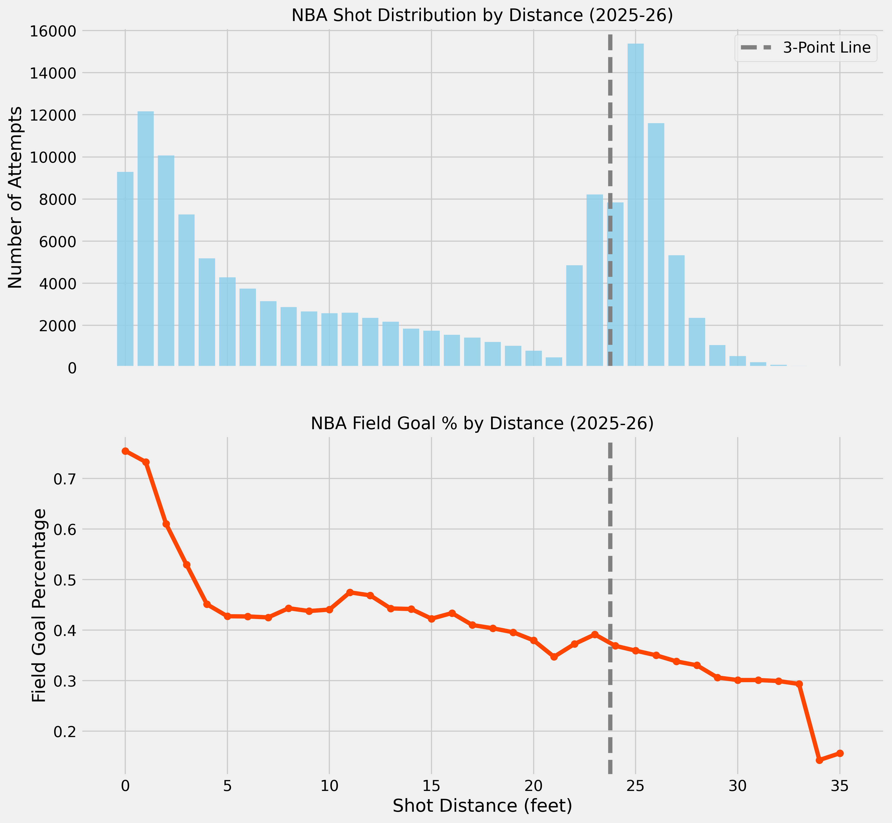
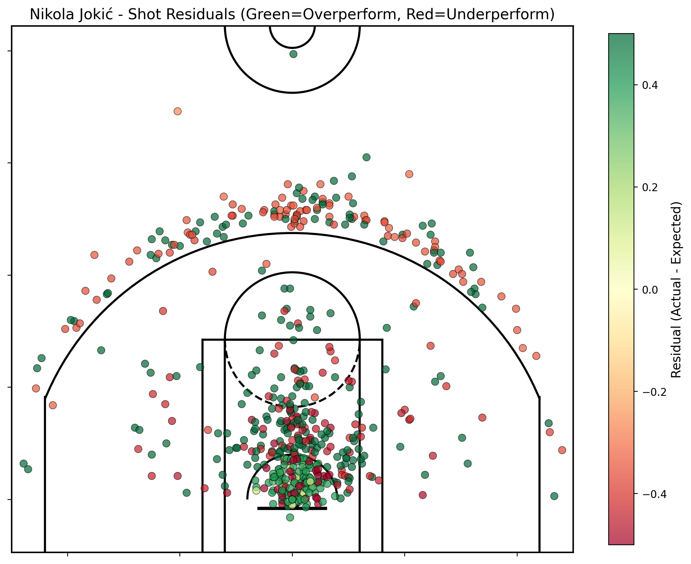
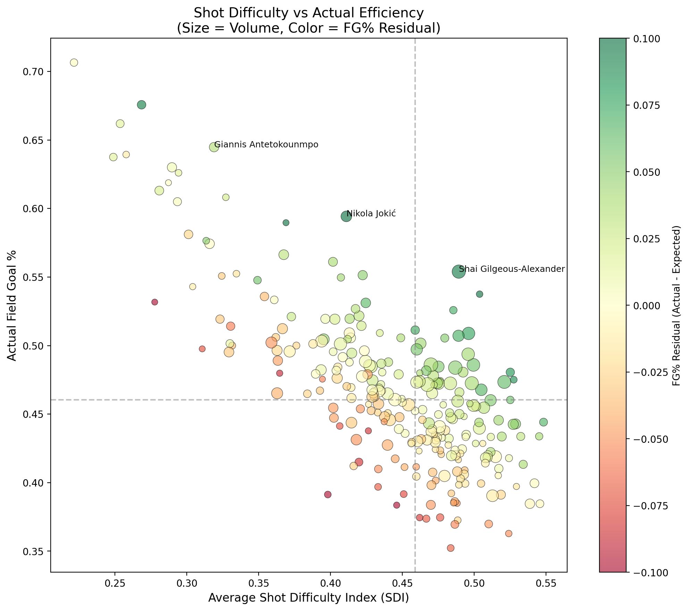
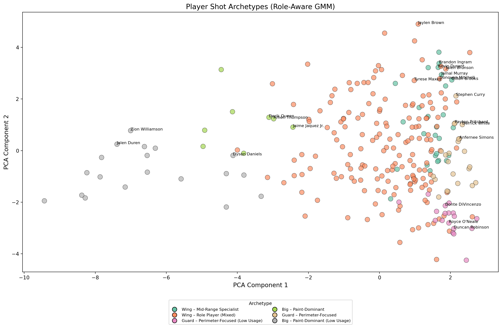
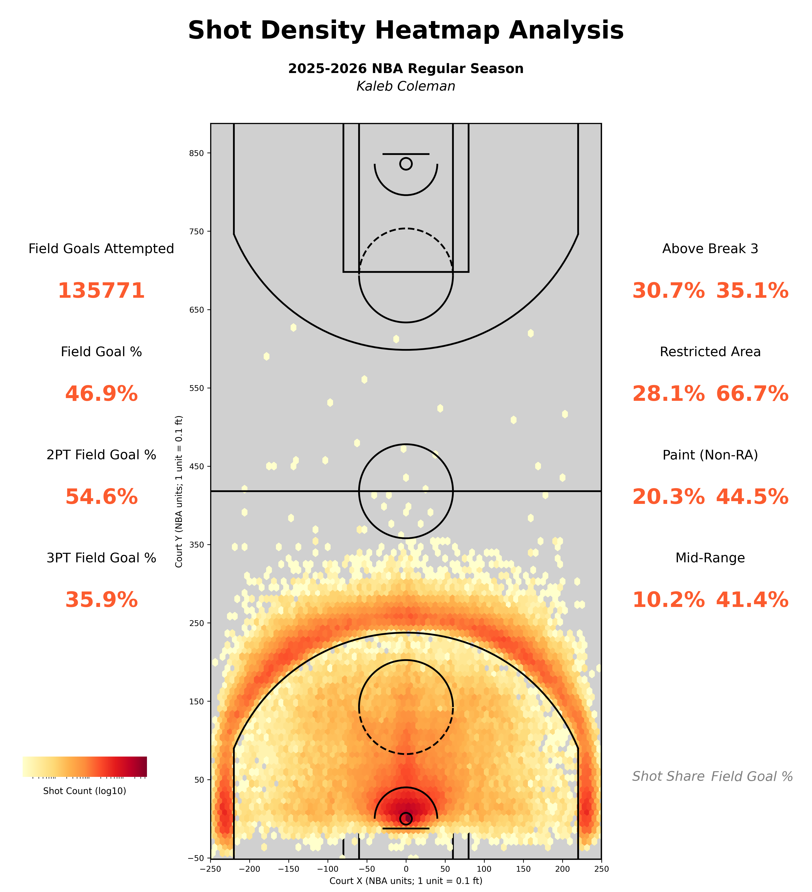
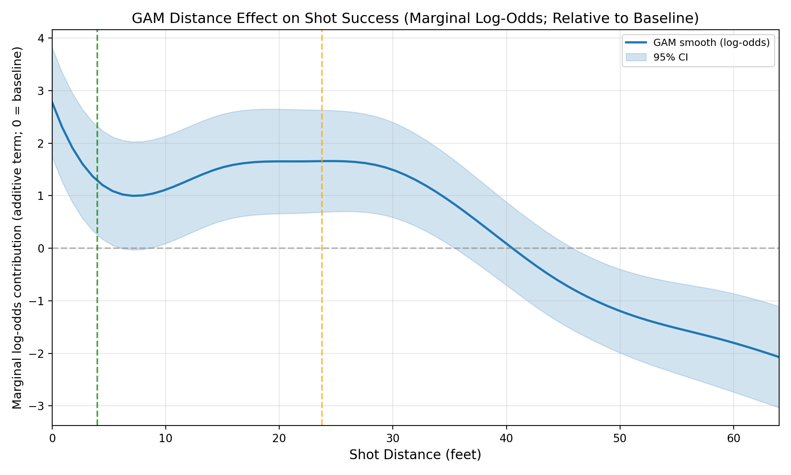
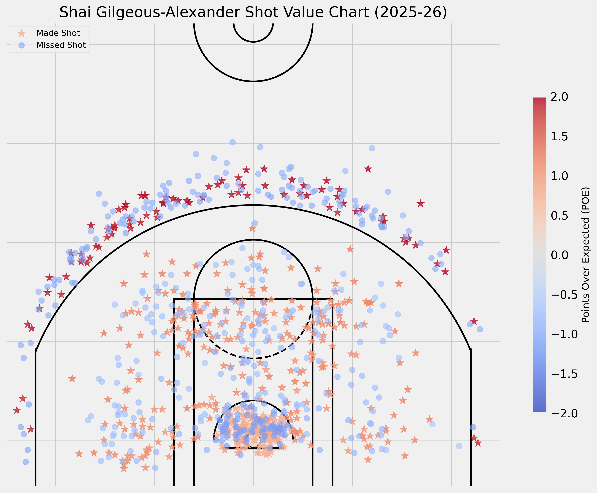
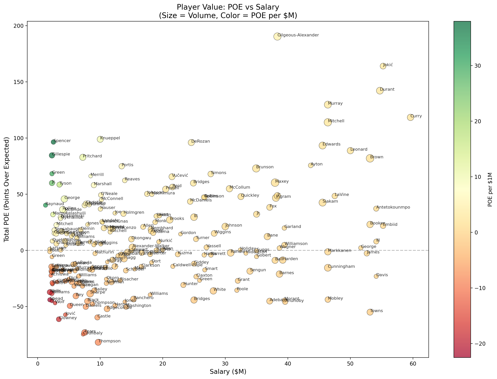
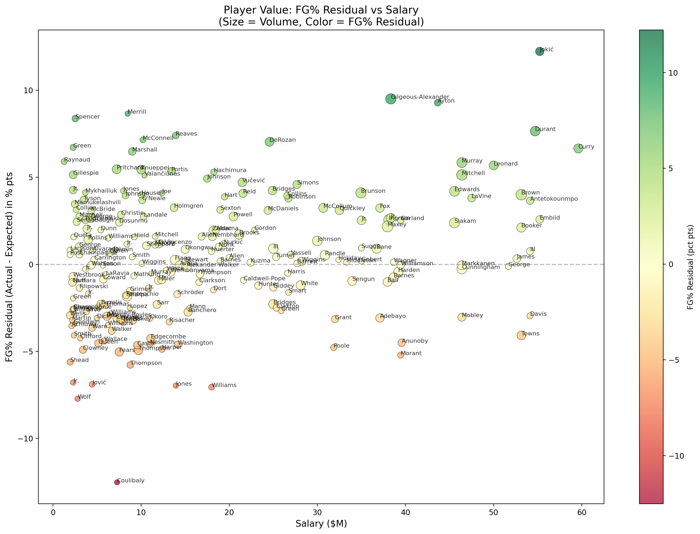

# Abstract

This paper presents a reproducible, end-to-end examination of NBA offensive strategy and player performance. We detail a comprehensive shot dataset compiled via a custom data pipeline spanning the 2014-15 through 2025-26 seasons. Using this data, we develop an expected field goal (xFG) model via logistic regression, achieving 63% accuracy with 0.653 AUC-ROC. Building on this foundation, we deliver three advanced analytics products: (1) Residual Analysis to identify players who over/underperform expectations, (2) a Shot Difficulty Index (SDI) quantifying shot complexity, and (3) K-Means clustering to identify player shot archetypes. We then integrate salary data to contextualize performance via POE per $1M and a complementary FG% residual vs salary view that isolates shot-making independent of free throws. Results highlight Nikola Jokić as a top overperformer (+12.9% residual) and surface distinct shot-profile archetypes (e.g., rim-heavy and high‑3PT profiles).

# Introduction

The National Basketball Association (NBA) has undergone a profound data revolution, fundamentally altering strategies and analysis. This paper addresses the challenge of translating shot data into actionable insights by leveraging a comprehensive, custom-built NBA shot dataset spanning the 2014-15 through 2025-26 seasons.

**Contributions**

- A reproducible data pipeline consolidating NBA shot data into an analysis-ready SQLite database.
- An expected field goal (xFG) model using logistic regression with 63% accuracy.
- Three advanced analytics products: Residual Analysis, Shot Difficulty Index, and Player Archetypes.
- A salary-adjusted value layer (POE per $1M) plus FG% residual vs salary to separate shot-making from free-throw effects.
- League-wide shot selection summaries including efficiency metrics and attempt distribution.
- Nonlinear effect summaries from a GAM model (partial dependence plots) to interpret how context changes shot success.

**Paper Roadmap**

Section 2 reviews relevant background. Section 3 details methods. Section 4 reports results including the xFG model and advanced analytics. Section 5 discusses findings and limitations.

# Related Work

Prior research on basketball analytics has emphasized the relationship between shot location and scoring efficiency. This study builds on that work by providing a fully reproducible xFG model and extending it with residual analysis, shot difficulty quantification, and player clustering.

# Methods

```{r setup, include=FALSE}
knitr::opts_chunk$set(echo = TRUE, message = FALSE, warning = FALSE)
set.seed(123)
suppressPackageStartupMessages({
  library(dplyr)
  library(arrow)
  library(knitr)
  library(DBI)
  library(RSQLite)
})
```

## Data Sources and Pipeline

The dataset was compiled through a custom R package interfacing with the NBA Stats API and ESPN NBA API. Raw JSON data was parsed, cleaned, and stored in a SQLite database (`nba.sqlite`) containing 2.5M+ shots across 12 seasons. [@nbaStatsAPI; @espnAPI]

**Pipeline overview**

1. **Collect**: `collect_raw()` downloads game-level JSON from ESPN and NBA Stats with caching and rate-limit handling.
2. **Parse**: `parse_raw()` normalizes raw JSON into standardized tables (games, events, shots, box scores, play-by-play).
3. **Validate**: `validate_tables()` enforces schema and key constraints to ensure referential integrity.
4. **Write**: `write_tables()` and `write_sqlite_from_rds()` persist data to `data/parsed/` and a consolidated SQLite file.

**Analysis scripts**

- `expected_points_analysis.py`: trains the xFG model and writes `shots_with_xp_*.parquet`
- `advanced_analytics.py`: residuals, SDI, and player archetype clustering
- `player_performance_analysis.py`: POE leaderboards and player shot charts
- `shot_density.py`: league-wide shot density heatmaps
- `salary_collector.py`: player salary data from Basketball-Reference [@basketballReference]
- `value_analysis.py`: POE per $1M salary rankings

## xFG Model

The expected field goal model uses logistic regression with the following features:

- **Spatial**: LOC_X, LOC_Y, shot distance, shot angle
- **Shot Type**: layup, dunk, jump shot, hook, floater indicators
- **Context**: period, seconds remaining, clutch indicator
- **Zones**: SHOT_ZONE_BASIC, SHOT_ZONE_AREA (one-hot encoded)

The model was trained on 80% of 2025-26 regular season shots and evaluated on the held-out 20%.

## GAM Model (Nonlinear Effects)

We additionally fit a Generalized Additive Model (GAM) to capture nonlinear relationships between shot success and spatial/context features. This model is not used for the main xFG predictions, but it provides interpretable partial dependence plots (PDPs) that clarify how shot probability changes across distance, angle, time, and location.

## Shot Difficulty Index (SDI)

SDI quantifies shot difficulty using a weighted combination:

$$SDI = 0.30 \times distance + 0.20 \times clock + 0.20 \times type + 0.15 \times zone + 0.15 \times angle$$

Higher SDI indicates a more difficult shot.

## Player Clustering

K-Means clustering was applied to player-level features:

- Zone percentages (6 zones)
- Average shot distance
- Pull-up rate (jump shot percentage)
- Average xFG and SDI
- Usage% (minutes-weighted from NBA Stats usage table)
- Attempts per game (usage proxy / fallback)

Clusters were reduced to 2D via PCA for visualization.

Archetype names are assigned *post‑hoc* using simple heuristics on cluster averages
(e.g., 3PT share, SDI, and usage level). These labels describe **shot profiles** only
and do not incorporate defensive role or on‑ball context.

## Analysis Dataset

```{r load-shots}
shots <- arrow::read_parquet("../data/shots_with_xp_2025-26.parquet")
residuals <- read.csv("../data/player_residuals.csv")
clusters <- read.csv("../data/player_clusters.csv")
```

# Results

## xFG Model Performance

```{r model-metrics}
metrics_files <- c("../data/model_metrics_xfg.csv", "../data/model_metrics_gam.csv")
metrics_list <- lapply(metrics_files, function(path) {
  if (file.exists(path)) {
    read.csv(path, stringsAsFactors = FALSE)
  } else {
    NULL
  }
})
metrics <- dplyr::bind_rows(metrics_list)

if (nrow(metrics) > 0) {
  metrics_display <- metrics |>
    transmute(
      Model = model,
      Season = season,
      `Season Type` = season_type,
      Accuracy = sprintf("%.1f%%", accuracy * 100),
      `AUC-ROC` = sprintf("%.3f", auc_roc),
      `Log Loss` = sprintf("%.3f", log_loss)
    )
  kable(metrics_display, caption = "Model Performance (xFG Logistic Regression and GAM)")
} else {
  kable(data.frame(Note = "Model metrics files not found. Run analysis scripts to generate metrics."),
        caption = "Model Performance")
}
```

## Summary Metrics

```{r summary-metrics}
summary_metrics <- shots |>
  mutate(
    shot_value = if_else(SHOT_TYPE == "3PT Field Goal", 3L, 2L),
    made = SHOT_MADE_FLAG == 1L
  ) |>
  summarise(
    attempts = n(),
    fg_pct = mean(made),
    fg2_pct = mean(made[SHOT_TYPE == "2PT Field Goal"]),
    fg3_pct = mean(made[SHOT_TYPE == "3PT Field Goal"]),
    avg_distance = mean(shot_distance_feet, na.rm = TRUE)
  )

kable(
  summary_metrics,
  digits = 3,
  caption = "League-wide shooting summary for the 2025-26 regular season."
)
```

## Shot Distribution

The shot chart and distance distribution contextualize league-wide shot selection. As expected in the modern NBA, attempts are concentrated at the rim and beyond the three-point line, while mid-range volume is comparatively low.

```{r shot-chart-fig, echo=FALSE, fig.cap="Shot distribution for the 2025-26 regular season.", fig.align="center", out.width="0.95\\linewidth", fig.pos="H"}
knitr::include_graphics("../figures/shot_chart_2025-26.png")
```

```{r shot-distance-fig, echo=FALSE, fig.cap="Shot distance distribution for the 2025-26 regular season.", fig.align="center", out.width="0.95\\linewidth", fig.pos="H"}

```

## Residual Analysis

```{r residuals-table}
top_over <- head(residuals, 10)
kable(
  top_over[, c("player", "avg_xFG", "actual_fg_pct", "residual_fg_pct", "attempts")],
  digits = 3,
  caption = "Top 10 Overperformers (Positive Residuals)"
)
```

```{r residual-heatmap-fig, echo=FALSE, fig.cap="Residual heatmap for top overperformer (Jokić).", fig.align="center", out.width="0.85\\linewidth", fig.pos="H"}

```

\newpage

## Shot Difficulty Index

```{r sdi-scatter-fig, echo=FALSE, fig.cap="SDI vs xFG scatter plot. Size indicates volume, color indicates actual FG\\%.", fig.align="center", out.width="0.95\\linewidth", fig.pos="H"}

```

## Player Archetypes

```{r clusters-table}
cluster_summary <- clusters |>
  group_by(archetype) |>
  summarise(
    count = n(),
    avg_distance = mean(avg_distance),
    avg_xFG = mean(avg_xFG),
    avg_sdi = mean(avg_sdi),
    avg_usage = mean(usage_pct, na.rm = TRUE),
    avg_apg = mean(attempts_per_game, na.rm = TRUE),
    .groups = "drop"
  )
kable(cluster_summary, digits = 3, caption = "Player Archetype Summary")
```

```{r cluster-scatter-fig, echo=FALSE, fig.cap="PCA visualization of player shot archetypes.", fig.align="center", out.width="0.95\\linewidth", fig.pos="H"}

```

## Shot Density

```{r shot-density-fig, echo=FALSE, fig.cap="League-wide shot density heatmap for the 2025-26 regular season.", fig.align="center", out.width="0.95\\linewidth", fig.pos="H"}

```

\newpage

## GAM Partial Dependence

The GAM highlights nonlinear effects that a linear model can only approximate. Distance exhibits a steep decline in make probability beyond the rim and provides an interpretable view of diminishing returns on long-range attempts.

```{r gam-distance-fig, echo=FALSE, fig.cap="GAM partial dependence for shot distance.", fig.align="center", out.width="0.85\\linewidth", fig.pos="H"}

```

\\newpage

## Player Performance (POE Shot Charts)

Player-level POE shot charts show where individual shot-making exceeds or falls short of model expectations.

```{r poe-shotchart-sga, echo=FALSE, fig.cap="Shai Gilgeous-Alexander POE shot chart (2025-26).", fig.align="center", out.width="0.9\\linewidth", fig.pos="H"}

```

## Player Value (POE vs Salary)

We combine POE with salary estimates to contextualize performance efficiency. This is not a definitive value model (it omits defense and usage context), but it provides a first-order lens on shot-making return per $1M.

```{r poe-salary-fig, echo=FALSE, fig.cap="Player value scatter: POE vs Salary with color encoding POE per $1M.", fig.align="center", out.width="0.95\\linewidth", fig.pos="H"}

```

## Player Value (FG Residual vs Salary)

POE can be influenced by free throws and usage context. To isolate *pure shot-making*, we also plot FG% residual (Actual FG% - Expected FG%) against salary. This view highlights which players beat expected shot quality on their field-goal attempts regardless of foul-drawing.

```{r fg-residual-salary-fig, echo=FALSE, fig.cap="Player value scatter: FG% residual vs Salary. Positive values indicate above-expected shot making.", fig.align="center", out.width="0.95\\linewidth", fig.pos="H"}

```

\newpage

# Discussion

## Key Findings

1. **Model Performance**: The logistic regression xFG model achieves 63% accuracy, near the theoretical ceiling without defender tracking data.

2. **Overperformers**: Nikola Jokić leads with +12.9% residual, indicating elite shot-making ability beyond what location and context predict.

3. **Shot Selection**: League-wide charts confirm the rim/three prioritization with suppressed mid-range volume.

4. **Shot Difficulty**: Players like Isaiah Joe and AJ Green take the most difficult shots (high SDI), while rim attackers like Gobert have low SDI.

5. **Archetypes**: Distinct *shot-profile* types emerged based on zone mix, SDI, and usage. Labels are heuristic and role‑agnostic:
   - **Rim Heavy / Low Distance**: Low distance, low SDI, high efficiency
   - **High 3PT / High SDI**: High distance, high SDI, moderate efficiency
   - **Balanced**: Moderate distance, moderate SDI

6. **Value Context**: POE per $1M adds a salary lens for identifying efficient shot makers relative to contract cost.
7. **Shot-Making Value**: FG% residual vs salary isolates pure shot-making value from free-throw effects, surfacing players who convert above expectation even without heavy foul drawing.
8. **Nonlinear Effects**: GAM partial dependence plots confirm strong non-linear penalties for shot distance, reinforcing the value of rim attempts and closer midrange looks.

## Implications

- **Player Evaluation**: Residual analysis identifies players who consistently beat expectations, valuable for player development and trade evaluation.
- **Shot Selection**: SDI helps distinguish players who take difficult shots by choice vs. those forced into them.
- **Team Building**: Archetype clustering can inform roster construction and lineup optimization.
- **Contract Efficiency**: Salary overlays provide a first-order signal for value-based decision making.
- **Shot-Making ROI**: FG% residual vs salary separates shot-making efficiency from free throws, helping identify underpaid pure shooters.
- **Coaching Emphasis**: GAM patterns quantify the marginal penalty of longer-distance attempts, supporting shot selection priorities.

## Limitations

This study uses league-wide averages and does not account for defensive pressure, which is the primary driver of shot difficulty. The xFG model is limited by the absence of tracking data. Salary data is scraped from a public source and may include reporting lags or contract nuances (current workflow uses 2024-25 salary data). FG residuals focus only on field-goal attempts and therefore do not capture value from free throws or playmaking.

# Conclusion

This paper presented an xFG model and three advanced analytics products for NBA shot analysis. The residual analysis, SDI, and player clustering provide actionable insights for player evaluation and team strategy. Future work should incorporate tracking data for defender distance and extend the analysis to team-level and lineup-level aggregations.

# References
